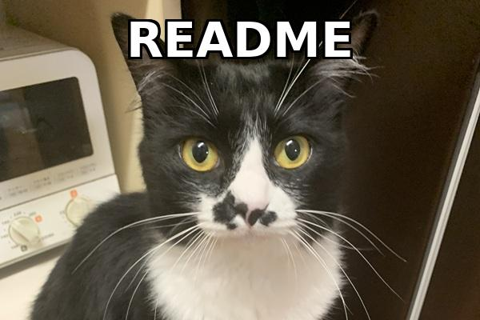
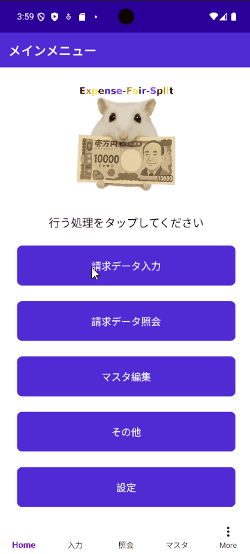

# 📱 Expense-Fair-Split
**費用を公平に分担・管理できるアプリ**

---

## 📝 概要
日常で発生する家賃・ガス・水道などの固定費や、買い物・外食といった支出を、科目ごとに整理しながら請求・管理できるアプリケーションです。  

ユーザーは自由に科目を追加でき、レシート撮影＋OCRによる入力補助にも対応。  

---

## ✨ 主な機能
-  請求科目マスタの追加・編集  
-  費用の入力および請求管理  
-  請求者・受領者ごとに基準に沿った自動按分計算  
-  請求明細のアーカイブ機能  
-  レシート撮影によるOCR自動入力（Androidのみ対応）  
-  Windows /  Android 両対応  

---

## 📦 開発環境 / 技術スタック
- **言語**: C# (.NET 8.0)  
- **フレームワーク**: .NET MAUI  
- **データベース**: SQLite / PostgreSQL  
- **OCR**: Google Cloud Vision API（Android）  
- **UIライブラリ**: Syncfusion  

---

## 💡 動作イメージ

